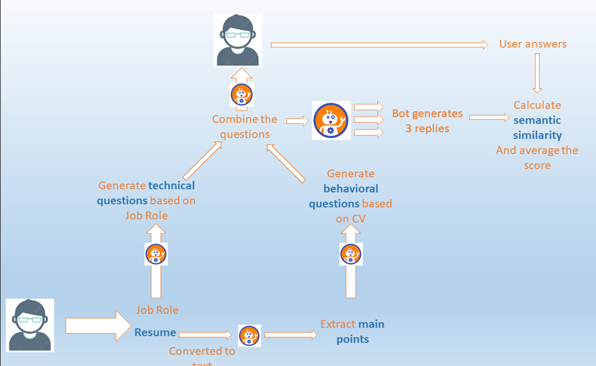
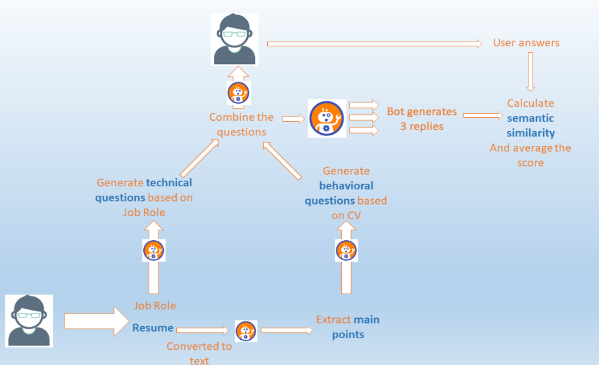
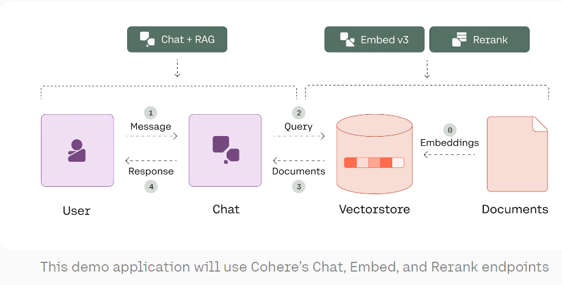
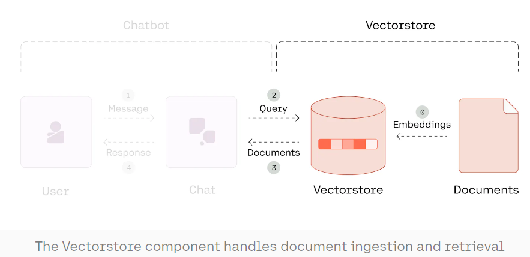
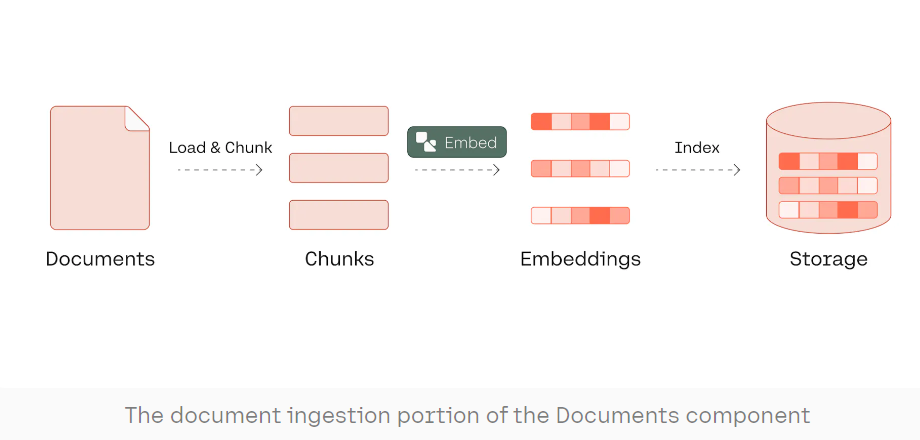
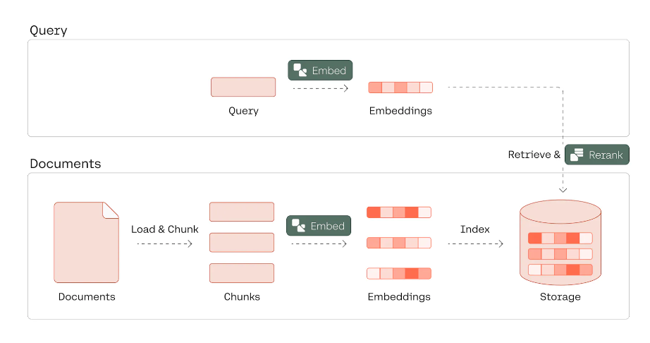
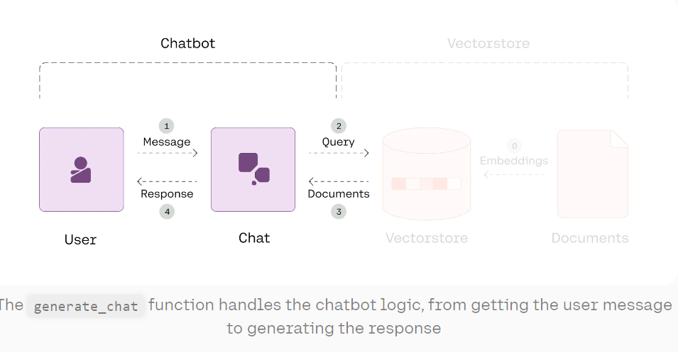

# Ask PDF


This is a Python application that allows you to load a PDF and ask questions about it using natural language. The application uses a LLM to generate a response about your PDF. The LLM will not answer questions unrelated to the document.

## How it works

The application reads the PDF and splits the text into smaller chunks that can be then fed into a LLM. It uses OpenAI embeddings to create vector representations of the chunks. The application then finds the chunks that are semantically similar to the question that the user asked and feeds those chunks to the LLM to generate a response.


The application uses Streamlit to create the GUI and Langchain to deal with the LLM.




## Installation

To install the repository, please clone this repository and install the requirements:

```
python -m pip install virtualenv
python -m virtualenv .venv
.venv\scripts\activate
```

```
pip install -r requirements.txt
```

You will also need to add your OpenAI API key to the `.env` file.

## Usage

To use the application, run the `main.py` file with the streamlit CLI (after having installed streamlit): 

```
streamlit run app.py
```


## Architecture
For each user-chatbot interaction:

Step 1: Get the user message
Step 2: Call the Chat endpoint in query-generation mode
If at least one query is generated:
Step 3: Retrieve and rerank relevant documents
Step 4: Call the Chat endpoint in document mode to generate a grounded response with citations
If no query is generated:
Step 4: Call the Chat endpoint in normal mode to generate a response


Chat: For handling the main logic of the chatbot, including turning a user message into queries, generating responses, and producing citations
Embed: For turning textual documents into their embeddings representation, later to be used in retrieval (we’ll use the latest Embed v3 model)
Rerank: For reranking the retrieved documents according to their relevance to a query (we’ll use the latest Rerank 3 model)



The Vectorstore class handles the ingestion of documents into embeddings (or vectors) and the retrieval of relevant documents given a query.



The attributes include self.raw_documents to represent the raw documents, self.docs to represent the chunked version of the documents, self.docs_embs to represent the embeddings of the chunked documents, and a couple of top_k parameters to be used for retrieval and reranking.

Meanwhile, the methods include load_and_chunk(), embed(), and index() for ingesting raw documents. As you’ll see, we will also specify a retrieve() method to retrieve relevant document chunks given a query.



Each chunk is turned into a dictionary with three fields:

title: The web page’s title
text: The textual content of the chunk
url: The web page’s URL

The retrieve() method uses semantic search to retrieve relevant document chunks given a query, and it has two steps: (1) dense retrieval, (2) reranking.



Search query generation: For each user message, we use the endpoint’s search query generation feature to turn the message into one or more queries that are optimized for retrieval. The endpoint can even return no query, which means that a user message can be responded to directly without retrieval. This is done by calling the Chat endpoint with the search_queries_only parameter and setting it as True.
Document retrieval: If there is no search query generated, we call the Chat endpoint to generate a response directly. If there is at least one, we call the retrieve method from the Vectorstore instance to retrieve the most relevant documents to each query.
Response and citation generation: Finally, all the results from all queries are appended to a list and passed to the Chat endpoint for response generation. We print the response, together with the citations and the list of document chunks cited, for easy reference.



If search queries are returned

If the chatbot response contains at least one search query, we call the retrieve() method from the Vectorstore class instance to retrieve document chunks that are relevant to the queries.

Then, we call the Chat endpoint to generate a response, adding a documents parameter to the call to pass the relevant document chunks.